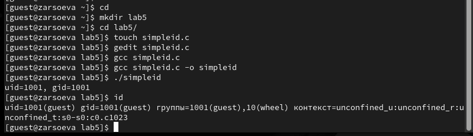
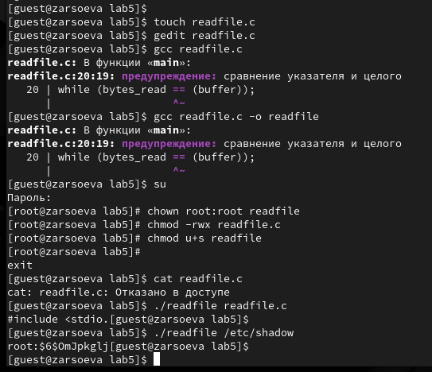
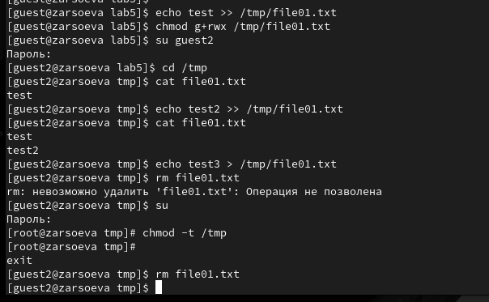

---
## Front matter
lang: ru-RU
title: Дискреционное разграничение прав в Linux. Исследование влияния дополнительных атрибутов
author: Залина Арсоева
institute: Российский Университет Дружбы Народов
date: 23 сентября, 2024, Москва, Россия

## Formatting
mainfont: PT Serif
romanfont: PT Serif
sansfont: PT Sans
monofont: PT Mono
toc: false
slide_level: 2
theme: metropolis
header-includes: 
 - \metroset{progressbar=frametitle,sectionpage=progressbar,numbering=fraction}
 - '\makeatletter'
 - '\beamer@ignorenonframefalse'
 - '\makeatother'
aspectratio: 43
section-titles: true

---

# Цели и задачи

## Теоретическое введение 

- SUID - разрешение на установку идентификатора пользователя. Это бит разрешения, который позволяет пользователю запускать исполняемый файл с правами владельца этого файла. 

- SGID - разрешение на установку идентификатора группы. Принцип работы очень похож на SUID с отличием, что файл будет запускаться пользователем от имени группы, которая владеет файлом.

## Цель лабораторной работы

Изучение механизмов изменения идентификаторов, применения SetUID и Sticky-битов. Получение практических навыков работы в консоли с дополнительными атрибутами. Рассмотрение работы механизма смены идентификатора процессов пользователей, а также влияние бита Sticky на запись и удаление файлов.

# Выполнение лабораторной работы

## Программа simpleid

{ #fig:001 width=70% height=70%}

## Программа simpleid2

{ #fig:002 width=70% height=70%}

## Программа readfile

{ #fig:003 width=70% height=70%}

## Исследование Sticky-бита

{ #fig:004 width=70% height=70%}

# Выводы

## Результаты выполнения лабораторной работы

Изучили механизмы изменения идентификаторов, применения SetUID- и Sticky-битов. Получили практические навыки работы в консоли с дополнительными атрибутами. Также мы рассмотрели работу механизма смены идентификатора процессов пользователей и влияние бита Sticky на запись и удаление файлов.