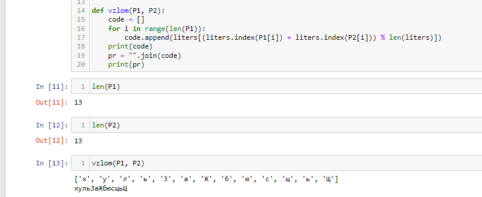
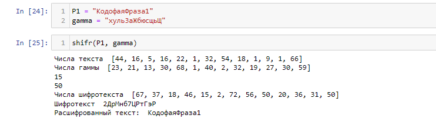

---
# Front matter
title: "Отчёт по лабораторной работе №8"
subtitle: "Шифр гаммирования"
author: "Залина Арсоева"

# Generic otions
lang: ru-RU
toc-title: "Содержание"

# Bibliography
bibliography: bib/cite.bib
csl: pandoc/csl/gost-r-7-0-5-2008-numeric.csl

# Pdf output format
toc: true # Table of contents
toc_depth: 2
lof: true # List of figures
fontsize: 12pt
linestretch: 1.5
papersize: a4
documentclass: scrreprt
## I18n
polyglossia-lang:
  name: russian
  options:
	- spelling=modern
	- babelshorthands=true
polyglossia-otherlangs:
  name: english
### Fonts
mainfont: PT Serif
romanfont: PT Serif
sansfont: PT Sans
monofont: PT Mono
mainfontoptions: Ligatures=TeX
romanfontoptions: Ligatures=TeX
sansfontoptions: Ligatures=TeX,Scale=MatchLowercase
monofontoptions: Scale=MatchLowercase,Scale=0.9
## Biblatex
biblatex: true
biblio-style: "gost-numeric"
biblatexoptions:
  - parentracker=true
  - backend=biber
  - hyperref=auto
  - language=auto
  - autolang=other*
  - citestyle=gost-numeric
## Misc options
indent: true
header-includes:
  - \linepenalty=10 # the penalty added to the badness of each line within a paragraph (no associated penalty node) Increasing the value makes tex try to have fewer lines in the paragraph.
  - \interlinepenalty=0 # value of the penalty (node) added after each line of a paragraph.
  - \hyphenpenalty=50 # the penalty for line breaking at an automatically inserted hyphen
  - \exhyphenpenalty=50 # the penalty for line breaking at an explicit hyphen
  - \binoppenalty=700 # the penalty for breaking a line at a binary operator
  - \relpenalty=500 # the penalty for breaking a line at a relation
  - \clubpenalty=150 # extra penalty for breaking after first line of a paragraph
  - \widowpenalty=150 # extra penalty for breaking before last line of a paragraph
  - \displaywidowpenalty=50 # extra penalty for breaking before last line before a display math
  - \brokenpenalty=100 # extra penalty for page breaking after a hyphenated line
  - \predisplaypenalty=10000 # penalty for breaking before a display
  - \postdisplaypenalty=0 # penalty for breaking after a display
  - \floatingpenalty = 20000 # penalty for splitting an insertion (can only be split footnote in standard LaTeX)
  - \raggedbottom # or \flushbottom
  - \usepackage{float} # keep figures where there are in the text
  - \floatplacement{figure}{H} # keep figures where there are in the text
---

# Цель работы

Освоить на практике применение режима однократного гаммирования на примере кодирования различных исходных текстов одним ключом.

# Теоретические сведения

## Шифр гаммирования

Гаммирование – это наложение (снятие) на открытые (зашифрованные) данные криптографической гаммы, т.е. последовательности элементов данных, вырабатываемых с помощью некоторого криптографического алгоритма, для получения зашифрованных (открытых) данных.

Принцип шифрования гаммированием заключается в генерации гаммы шифра с помощью датчика псевдослучайных чисел и наложении полученной гаммы шифра на открытые данные обратимым образом (например, используя операцию сложения по модулю 2). Процесс дешифрования сводится к повторной генерации гаммы шифра при известном ключе и наложении такой же гаммы на зашифрованные данные.
Полученный зашифрованный текст является достаточно трудным для раскрытия в том случае, если гамма шифра не содержит повторяющихся битовых последовательностей и изменяется случайным образом для каждого шифруемого слова. Если период гаммы превышает длину всего зашифрованного текста и неизвестна никакая часть исходного текста, то шифр можно раскрыть только прямым перебором (подбором ключа). В этом случае криптостойкость определяется размером ключа.

Метод гаммирования становится бессильным, если известен фрагмент исходного текста и соответствующая ему шифрограмма. В этом случае простым вычитанием по модулю 2 получается отрезок псевдослучайной последовательности и по нему восстанавливается вся эта последовательность.

Метод гаммирования с обратной связью заключается в том, что для получения сегмента гаммы используется контрольная сумма определенного участка шифруемых данных. Например, если рассматривать гамму шифра как объединение непересекающихся множеств H(j), то процесс шифрования можно пердставить следующими шагами:

1. Генерация сегмента гаммы H(1) и наложение его на соответствующий участок шифруемых данных.

2. Подсчет контрольной суммы участка, соответствующего сегменту гаммы H(1).

3. Генерация с учетом контрольной суммы уже зашифрованного участка данных следующего сегмента гамм H(2).

4. Подсчет контрольной суммы участка данных, соответствующего сегменту данных H(2) и т.д.

## Идея взлома

Шифротексты обеих телеграмм можно получить по формулам режима однократного гаммирования:

$$C_1 = P_1 \oplus K$$
$$C_2 = P_2 \oplus K$$

Открытый текст можно найти, зная шифротекст двух телеграмм, зашифрованных одним ключом. Для это оба равенства складываются по модулю 2. Тогда с учётом свойства операции XOR получаем:

$$C_1 \oplus C_2 = P_1 \oplus  K \oplus  P_2 \oplus  K = P_1 \oplus P_2$$

Предположим, что одна из телеграмм является шаблоном — т.е. имеет текст фиксированный формат, в который вписываются значения полей.
Допустим, что злоумышленнику этот формат известен. 
Тогда он получает достаточно много пар $C_1 \oplus C_2$ (известен вид обеих шифровок).
Тогда зная $P_1$ имеем:

$$C_1 \oplus C_2 \oplus P_1 = P_1 \oplus P_2 \oplus P_1 = P_2$$ 

Таким образом, злоумышленник получает возможность определить те символы сообщения $P_2$, которые находятся на позициях известного шаблона сообщения $P_1$.
В соответствии с логикой сообщения $P_2$, злоумышленник имеет реальный шанс узнать ещё некоторое количество символов сообщения $P_2$.
Затем вновь используется равенство с подстановкой вместо $P_1$ полученных на предыдущем шаге новых символов сообщения $P_2$.
И так далее. Действуя подобным образом, злоумышленник даже если не прочитает оба сообщения, то значительно уменьшит пространство их поиска.

# Выполнение работы

## Реализация взломщика, шифратора и дешифратора на Python

```
a = ord("а")
liters = [chr(i) for i in range(a, a + 32)]
a = ord("0")
for i in range(a, a+10):
    liters.append(chr(i))

a = ord("А")
for i in range(1040, 1072):
    liters.append(chr(i))

P1 = "КодофаяФраза1"
P2 = "Безопасность2"

def vzlom(P1, P2):
    code = []
    for i in range(len(P1)):
        code.append(liters[(liters.index(P1[i]) + liters.index(P2[i])) % len(liters)])
    print(code)
    pr = "".join(code)
    print(pr)
```

```
def shifr(P1, gamma):
    dicts = {"а": 1, "б": 2, "в": 3, "г": 4, "д": 5, "е": 6, "ё": 7, "ж": 8, "з": 9, "и": 10, "й": 11, "к": 12, "л": 13,
             "м": 14, "н": 15, "о": 16, "п": 17, "р": 18, "с": 19, "т": 20, "у": 21, "ф": 22, "х": 23, "ц": 24, "ч": 25, 
             "ш": 26, "щ": 27, "ъ": 28, "ы": 29, "ь": 30, "э": 31, "ю": 32, "я": 32, "А":33 , "Б": 34, "В": 35 , "Г":36, 
             "Д":37 , "Е":38 , "Ё":39 , "Ж":40 , "З":41, "И":42,"Й":43 , "К":44 , "Л":45 , "М":46 , "Н":47 , "О":48 , 
             "П":49 , "Р":50 , "С":51 , "Т":52 , "У":53 , "Ф":54 , "Х":55 , "Ц":56 , "Ч":57 , "Ш":58,"Щ":59 , "Ъ":60 , 
             "Ы":61 , "Ь":62 , "Э":63 , "Ю":64 , "Я":65 , "1":66 , "2":67 , "3":68 , "4":69 , "5":70 , "6":71 , "7": 72, 
             "8":73 , "9":74 , "0":75
    }
    
    dicts2 = {v: k for k, v in dicts.items()}
    text = P1
    digits_text = []
    digits_gamma = []

    for i in text:
        digits_text.append(dicts[i])
    print("Числа текста ", digits_text)
    
    for i in gamma:
        digits_gamma.append(dicts[i])
    print("Числа гаммы ", digits_gamma)
    
    digits_result = []
    ch = 0
    for i in text:
        try:
            a = dicts[i] + digits_gamma[ch]
        except:
            ch = 0
            a = dicts[i] + digits_gamma[ch]
        if a > 75:
            a = a%75
            print(a)
        ch += 1
        digits_result.append(a)
    print("Числа шифротекста ", digits_result)
    
    text_cr = ""
    for i in digits_result:
        text_cr += dicts2[i]
    print("Шифротекст ", text_cr)
    
    digits = []
    for i in text_cr:
        digits.append(dicts[i])
    ch = 0
    digits1 = []
    for i in digits:
        try:
            a = i - digits_gamma[ch]
        except:
            ch = 0
            a = i - digits_gamma[ch]
        if a < 1:
            a = 75 + a
        digits1.append(a)
        ch += 1
    
    text_decr = ""
    for i in digits1:
        text_decr += dicts2[i]
    print("Расшифрованный текст: ", text_decr)
```

## Контрольный пример

{ #fig:001 width=70% height=70%}

{ #fig:002 width=70% height=70%}


# Выводы

В ходе выполнения лабораторной работы было разработано приложение, позволяющее шифровать тексты в режиме однократного гаммирования.

# Список литературы{.unnumbered}

1. [Шифрование методом гаммирования](http://altaev-aa.narod.ru/security/XOR.html)
2. [Режим гаммирования в блочном алгоритме шифрования](https://kabinfo.ucoz.ru/index/shifr_reshetka_kardano/0-374)